# System Architecture

This document describes the high-level architecture of the GitHub Automation Agent.

## Overview

The system is designed with a **Backend Core** acting as the "brain" and a **Frontend Dashboard** acting as a consumer/observer.

- **Backend Core**: Handles webhooks, orchestrates parallel agents, and manages session memory.
- **Session Memory Store**: A first-class component that persists run history, metrics, and logs.
- **Agents**: Specialized components for code review, documentation updates, and specification tracking.
- **Frontend**: A React dashboard that visualizes the system state by consuming APIs exposed by the backend.

## Diagram

```mermaid
graph TD
    %% Styles
    classDef component fill:#e1f5fe,stroke:#01579b,stroke-width:2px;
    classDef memory fill:#fff9c4,stroke:#fbc02d,stroke-width:2px;
    classDef external fill:#f3e5f5,stroke:#7b1fa2,stroke-width:2px;
    classDef orchestrator fill:#e8f5e9,stroke:#2e7d32,stroke-width:2px;
    classDef frontend fill:#ffe0b2,stroke:#f57c00,stroke-width:2px;
    classDef primary fill:#d1c4e9,stroke:#512da8,stroke-width:3px;
    classDef fallback fill:#f5f5f5,stroke:#9e9e9e,stroke-width:2px,stroke-dasharray: 5,5;

    %% External Systems
    subgraph External["External Systems"]
        GitHub[GitHub Push Event]:::external
        GitHubAPI[GitHub API]:::external
        LLM["LLM (Gemini/OpenAI/Anthropic)"]:::fallback
        Jules["Jules / Google Code Review API"]:::primary
    end

    %% Backend Core (The Brain)
    subgraph Backend["Backend Core (The Brain)"]
        Webhook[Webhook Server]:::component
        Orchestrator[Async Orchestrator]:::orchestrator
        SessionMem[Session Memory Store]:::memory
        
        %% Review Providers Abstraction
        subgraph ReviewAbstraction["Review Providers"]
            ReviewProv[ReviewProvider Interface]:::component
        end

        %% Parallel Tasks
        subgraph Tasks["Parallel Tasks"]
            Reviewer[Code Reviewer]:::component
            ReadmeUp[README Updater]:::component
            SpecUp[Spec Updater]:::component
            ReviewUp[Code Review Updater]:::component
        end
    end

    %% Artifacts
    subgraph Artifacts["Repo Artifacts"]
        SpecMD[spec.md]:::memory
        ReadmeMD[README.md]:::memory
        ReviewMD[code_review.md]:::memory
    end

    %% Frontend (Consumer)
    subgraph Frontend["Frontend (Consumer)"]
        Dashboard[React Dashboard]:::frontend
    end

    %% Data Flow
    GitHub -->|POST /webhook| Webhook
    Webhook -->|Trigger| Orchestrator
    Orchestrator -->|Init Run| SessionMem
    Orchestrator -->|Parallel Exec| Reviewer
    Orchestrator -->|Parallel Exec| ReadmeUp
    Orchestrator -->|Parallel Exec| SpecUp
    Orchestrator -->|Parallel Exec| ReviewUp
    Orchestrator -->|Update Status| SessionMem

    %% Dashboard Interactions
    Dashboard -->|Fetch Metrics/History| Webhook
    Webhook -.->|Read| SessionMem

    %% Component Interactions
    Reviewer -->|Delegate| ReviewProv
    ReadmeUp -->|Delegate| ReviewProv
    SpecUp -->|Delegate| ReviewProv
    
    ReviewProv -->|Primary| Jules
    ReviewProv -.->|Fallback| LLM
    
    Reviewer -->|Post Comment| GitHubAPI
    Reviewer -->|Log Result| SessionMem

    ReadmeUp -->|Read Content| ReadmeMD
    ReadmeUp -->|Create PR| GitHubAPI
    ReadmeUp -->|Log Result| SessionMem

    SpecUp -->|Read History| SpecMD
    SpecUp -->|Append Entry| GitHubAPI
    SpecUp -->|Log Result| SessionMem

    ReviewUp -->|Read Log| ReviewMD
    ReviewUp -->|Summarize| LLM
    ReviewUp -->|Append Log| GitHubAPI
    
    %% Memory Updates
    SpecUp -.->|Update| SpecMD
    ReadmeUp -.->|Update| ReadmeMD
    ReviewUp -.->|Update| ReviewMD

    %% Note
    note[Review Providers are pluggable.<br/>Uses Jules API when available,<br/>falls back to LLM.]
    ReviewProv --- note
    
```



## Pluggable Review Architecture

The system features a **Pluggable Review Provider** layer that abstracts the underlying review engine.

**Flow:**
`GitHub Push → Orchestrator → Code Reviewer → Review Providers → (Jules API / LLM) → GitHub Feedback`

- **Primary**: **Jules / Google Code Review API** is used for high-quality, specialized code reviews.
- **Fallback**: If Jules is unavailable or fails, the system automatically falls back to **LLM Providers** (Gemini, OpenAI, Anthropic) to ensure continuity.
- **Abstraction**: The `ReviewProvider` interface ensures that `CodeReviewer`, `ReadmeUpdater`, and `SpecUpdater` are agnostic to the underlying engine.

## Live Updates

To ensure this diagram stays in sync with the codebase, use the `generate_architecture_diagram.py` script.

### Manual Generation
Run the script to update this file:
```bash
python generate_architecture_diagram.py
```

### CI/CD Integration
This file is automatically updated on every push to main via GitHub Actions.

---

## Recent Enhancements

### Dashboard Real Data Integration

The React Dashboard now displays **real, live data** instead of mocks:

**Data Sources:**
- **Coverage**: Real metrics from `coverage.xml` (pytest --cov)
- **LLM Metrics**: Token usage, cost, efficiency from `SessionMemoryStore`
- **Bugs**: Real GitHub issues labeled "bug" via GitHub API
- **PRs**: Real open pull requests with check status via GitHub API
- **Tasks**: Real task statuses from automation run history
- **Architecture**: Live Mermaid diagram from `ARCHITECTURE.md`

**API Endpoints:**
- `GET /api/metrics` - Aggregated dashboard metrics
- `GET /api/history` - Session memory run history
- `GET /api/architecture` - Live architecture diagram
- `POST /webhook` - GitHub webhook receiver

**Implementation:**
- `github_client.py`: Added `list_issues()` and `list_pull_requests()` methods
- `api_server.py`: Helper functions `_fetch_bugs()`, `_fetch_prs()`, `_parse_coverage()`
- `App.tsx`: Fetches and displays real data from API

### Mutation Testing (Linux/Mac/CI Only)

**Platform Support:**
- ✅ **Linux/Mac**: Full mutation testing with mutmut
- ✅ **CI/CD**: GitHub Actions workflow on Ubuntu runners
- ⚠️ **Windows**: Gracefully skipped (mutmut requires Unix `resource` module)

**Components:**
- `mutation_service.py`: Core mutation testing service
  - `run_mutation_tests()`: Executes mutmut and parses results
  - `get_latest_results()`: Reads cached results from JSON
  - OS detection: Returns "skipped" status on Windows

**API Endpoints:**
- `POST /api/mutation/run` - Trigger mutation tests (background task)
- `GET /api/mutation/results` - Fetch latest mutation test results
- `GET /api/metrics` - Includes mutation score from cached results

**Results Storage:**
- `mutation_results.json`: Cached mutation test results
  - mutation_score (0-100%)
  - mutants_total, killed, survived, timeout, suspicious
  - last_run_time, runtime_seconds
  - status (for Windows: "skipped")

**CI/CD Integration:**
- `.github/workflows/mutation-tests.yml`: Automated mutation testing
  - Runs on push to main or manual trigger
  - Executes pytest + mutmut on Ubuntu
  - Saves results as artifacts (30 days)
  - Optional PR comments with mutation scores

**Configuration:**
```bash
ENABLE_MUTATION_TESTS=True  # Feature flag
MUTATION_MAX_RUNTIME_SECONDS=600  # 10 minute timeout
```

### Security Enhancements

**XML Parsing:**
- Replaced `xml.etree.ElementTree` with `defusedxml` for secure XML parsing
- Prevents XXE (XML External Entity) attacks
- Used in `_parse_coverage()` to read `coverage.xml`

**Bandit Compliance:**
- 0 Medium/High severity issues
- All security best practices followed
- `# nosec` comments for intentional exceptions

## Data Flow Summary

```
GitHub Push Event
    ↓
Webhook Server (FastAPI)
    ↓
Orchestrator (Async)
    ↓
┌─────────────┬──────────────┬─────────────┬──────────────┐
│             │              │             │              │
Code Review   README Update  Spec Update   Review Logger
│             │              │             │              │
└─────────────┴──────────────┴─────────────┴──────────────┘
    ↓
Session Memory Store
    ↓
Dashboard API (/api/metrics, /api/history)
    ↓
React Dashboard (Real-time visualization)
```

## Technology Stack

**Backend:**
- FastAPI (API server + webhook receiver)
- Flask (legacy webhook support)
- httpx (async HTTP client)
- defusedxml (secure XML parsing)

**Frontend:**
- React + TypeScript
- Vite (build tool)
- Mermaid (architecture diagrams)
- Lucide React (icons)

**Testing:**
- pytest (unit/integration tests)
- pytest-cov (coverage reporting)
- mutmut (mutation testing - Linux/Mac/CI only)
- bandit (security scanning)

**LLM Providers:**
- Google Gemini (primary)
- OpenAI GPT-4
- Anthropic Claude
- Jules / Google Code Review API (specialized reviews)

**Infrastructure:**
- GitHub Actions (CI/CD)
- Session Memory (JSON-based persistence)
- GitHub API (issues, PRs, commits)

