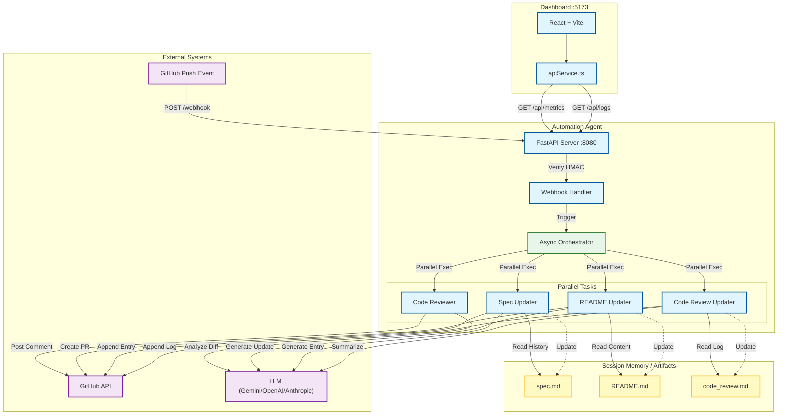

# System Architecture

**Last Updated:** 2025-11-30  
**Version:** 2.0 (FastAPI + Dashboard Integration)

This document describes the high-level architecture of the GitHub Automation Agent.

## Diagram



## Live Updates

To ensure this diagram stays in sync with the codebase, use the `generate_architecture_diagram.py` script.

### Manual Generation
Run the script to output the current Mermaid syntax:
```bash
python generate_architecture_diagram.py
```

### CI/CD Integration (Recommended)
You can add a GitHub Actions workflow to verify that the diagram in `ARCHITECTURE.md` matches the script output.

**Example Step:**
```yaml
- name: Verify Architecture Diagram
  run: |
    python generate_architecture_diagram.py > current_diagram.mmd
    # Compare with existing diagram or fail if out of sync
```

### Best Practices
1.  **Single Source of Truth**: Treat the code as the truth. The diagram is a view of the code.
2.  **Automate**: Use pre-commit hooks or CI jobs to regenerate the diagram when core files change.
3.  **Review**: Include architecture changes in code reviews.

## Component Details

### Entry Points

| Component | File | Port | Purpose |
|-----------|------|------|---------|
| **FastAPI Server** | `api_server.py` | 8080 | Main server - webhooks + Dashboard API |
| **Flask Server** | `webhook_server.py` | 8080 | Legacy webhook-only server |
| **Dashboard** | `dashboard/` | 5173 | React + Vite frontend |

### API Endpoints

| Endpoint | Method | Description |
|----------|--------|-------------|
| `/` | GET | Health check with uptime |
| `/api/metrics` | GET | Dashboard metrics (coverage, LLM, tasks, logs) |
| `/api/logs` | GET | System logs |
| `/api/repository/{name}/status` | GET | Repository status |
| `/webhook` | POST | GitHub webhook (HMAC verified) |

### Core Modules

| Module | Purpose |
|--------|---------|
| `orchestrator.py` | Coordinates 4 parallel tasks via `asyncio.gather()` |
| `code_reviewer.py` | LLM-powered code analysis → GitHub comments/issues |
| `readme_updater.py` | Detects changes → creates documentation PRs |
| `spec_updater.py` | Appends progress entries to spec.md |
| `code_review_updater.py` | Maintains persistent review log in code_review.md |
| `github_client.py` | Async GitHub API wrapper (httpx) |
| `llm_client.py` | Multi-provider LLM abstraction (Gemini/OpenAI/Anthropic) |

### Technology Stack

| Layer | Technology |
|-------|------------|
| **Backend** | Python 3.11, FastAPI, Flask, asyncio |
| **Frontend** | React 18, Vite, TypeScript, TailwindCSS |
| **LLM** | Gemini 2.0 Flash (default), OpenAI, Anthropic |
| **API Client** | httpx (async), requests |
| **Testing** | pytest, pytest-asyncio, 99/99 tests passing |
| **Security** | HMAC-SHA256, Bandit static analysis |
