# System Architecture

This document describes the high-level architecture of the GitHub Automation Agent.

## Overview

The system is designed with a **Backend Core** acting as the "brain" and a **Frontend Dashboard** acting as a consumer/observer.

- **Backend Core**: Handles webhooks, orchestrates parallel agents, and manages session memory.
- **Session Memory Store**: A first-class component that persists run history, metrics, and logs.
- **Agents**: Specialized components for code review, documentation updates, and specification tracking.
- **Frontend**: A React dashboard that visualizes the system state by consuming APIs exposed by the backend.

## Diagram

```mermaid
graph TD
    %% Styles
    classDef component fill:#e1f5fe,stroke:#01579b,stroke-width:2px;
    classDef memory fill:#fff9c4,stroke:#fbc02d,stroke-width:2px;
    classDef external fill:#f3e5f5,stroke:#7b1fa2,stroke-width:2px;
    classDef orchestrator fill:#e8f5e9,stroke:#2e7d32,stroke-width:2px;
    classDef frontend fill:#ffe0b2,stroke:#f57c00,stroke-width:2px;

    %% External Systems
    subgraph External["External Systems"]
        GitHub[GitHub Push Event]:::external
        GitHubAPI[GitHub API]:::external
        LLM["LLM (Gemini/OpenAI/Anthropic)"]:::external
    end

    %% Backend Core (The Brain)
    subgraph Backend["Backend Core (The Brain)"]
        Webhook[Webhook Server]:::component
        Orchestrator[Async Orchestrator]:::orchestrator
        SessionMem[Session Memory Store]:::memory
        
        %% Parallel Tasks
        subgraph Tasks["Parallel Tasks"]
            Reviewer[Code Reviewer]:::component
            ReadmeUp[README Updater]:::component
            SpecUp[Spec Updater]:::component
            ReviewUp[Code Review Updater]:::component
        end
    end

    %% Artifacts
    subgraph Artifacts["Repo Artifacts"]
        SpecMD[spec.md]:::memory
        ReadmeMD[README.md]:::memory
        ReviewMD[code_review.md]:::memory
    end

    %% Frontend (Consumer)
    subgraph Frontend["Frontend (Consumer)"]
        Dashboard[React Dashboard]:::frontend
    end

    %% Data Flow
    GitHub -->|POST /webhook| Webhook
    Webhook -->|Trigger| Orchestrator
    Orchestrator -->|Init Run| SessionMem
    Orchestrator -->|Parallel Exec| Reviewer
    Orchestrator -->|Parallel Exec| ReadmeUp
    Orchestrator -->|Parallel Exec| SpecUp
    Orchestrator -->|Parallel Exec| ReviewUp
    Orchestrator -->|Update Status| SessionMem

    %% Dashboard Interactions
    Dashboard -->|Fetch Metrics/History| Webhook
    Webhook -.->|Read| SessionMem

    %% Component Interactions
    Reviewer -->|Analyze Diff| LLM
    Reviewer -->|Post Comment| GitHubAPI
    Reviewer -->|Log Result| SessionMem

    ReadmeUp -->|Read Content| ReadmeMD
    ReadmeUp -->|Generate Update| LLM
    ReadmeUp -->|Create PR| GitHubAPI
    ReadmeUp -->|Log Result| SessionMem

    SpecUp -->|Read History| SpecMD
    SpecUp -->|Generate Entry| LLM
    SpecUp -->|Append Entry| GitHubAPI
    SpecUp -->|Log Result| SessionMem

    ReviewUp -->|Read Log| ReviewMD
    ReviewUp -->|Summarize| LLM
    ReviewUp -->|Append Log| GitHubAPI
    
    %% Memory Updates
    SpecUp -.->|Update| SpecMD
    ReadmeUp -.->|Update| ReadmeMD
    ReviewUp -.->|Update| ReviewMD
    
```



## Live Updates

To ensure this diagram stays in sync with the codebase, use the `generate_architecture_diagram.py` script.

### Manual Generation
Run the script to update this file:
```bash
python generate_architecture_diagram.py
```

### CI/CD Integration
This file is automatically updated on every push to main via GitHub Actions.
