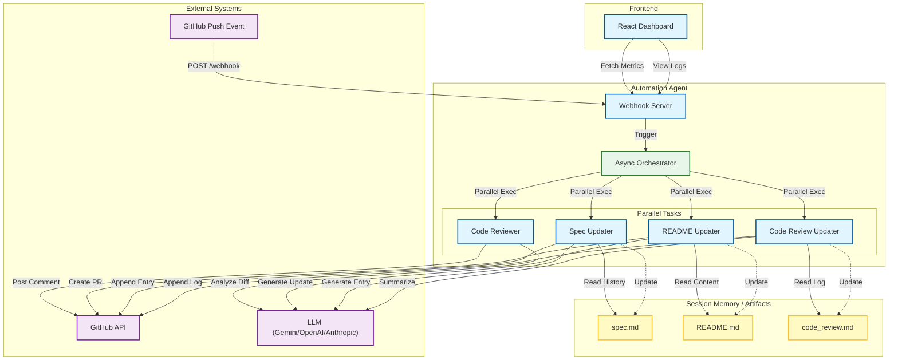

# System Architecture

This document describes the high-level architecture of the GitHub Automation Agent.

## Diagram



## Live Updates

To ensure this diagram stays in sync with the codebase, use the `generate_architecture_diagram.py` script.

### Manual Generation
Run the script to output the current Mermaid syntax:
```bash
python generate_architecture_diagram.py
```

### CI/CD Integration (Recommended)
You can add a GitHub Actions workflow to verify that the diagram in `ARCHITECTURE.md` matches the script output.

**Example Step:**
```yaml
- name: Verify Architecture Diagram
  run: |
    python generate_architecture_diagram.py > current_diagram.mmd
    # Compare with existing diagram or fail if out of sync
```

### Best Practices
1.  **Single Source of Truth**: Treat the code as the truth. The diagram is a view of the code.
2.  **Automate**: Use pre-commit hooks or CI jobs to regenerate the diagram when core files change.
3.  **Review**: Include architecture changes in code reviews.
