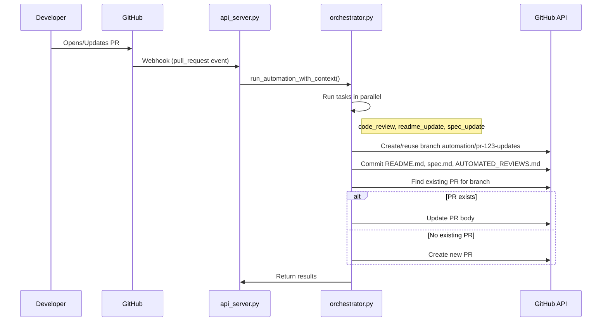

# 🤖 GitHub Automation Agent

An autonomous GitHub automation system that triggers on **push and pull request events** to perform intelligent code review, automatic README and code_review.md updates, and project progress documentation. Features **PR-centric orchestration** with trivial change filtering to optimize LLM token usage.

## 💡 Why This Agent?

- **Reduces repetitive code review work** — highlights risky changes and suggests fixes automatically
- **Keeps docs always fresh** — README, spec.md, and AUTOMATED_REVIEWS.md stay in sync with actual code changes
- **Intelligent layer over GitHub** — uses advanced LLMs + async orchestration instead of rigid YAML workflows

---

## 🎯 Key Capabilities

### 1. StudioAI CLI

The `studioai` CLI provides easy configuration management:

```bash
# Initialize configuration


studioai init

# Interactive configuration
studioai configure

# Check system status
studioai status

# Test PR automation flow
studioai test-pr-flow
```

Configuration is stored in `studioai.config.json` and can also be edited via:
- **Dashboard**: Visual config panel with toggles and dropdowns
- **API**: `PATCH /api/config` endpoint for programmatic updates
- **Environment Variables**: Override any setting via env vars

### 2. Interactive Dashboard

Real-time monitoring and manual control via React dashboard (http://localhost:5173):

**Manual Trigger**:
- Trigger automation for any commit or branch without waiting for events
- Input: Commit SHA or branch name  
- Use case: Re-run automation after config changes, test on old commits
- Location: Purple gradient panel at top of left column

**Retry Failed Runs**:
- One-click retry for failed automation runs
- Automatically reconstructs original run context (PR or push)
- Instant feedback with loading states and toast notifications
- Location: "Retry" button next to failed runs

**Features**:
- ✅ Loading states with spinners
- ✅ Toast notifications for success/error  
- ✅ Automatic data refresh
- ✅ Real-time log viewer
- ✅ Live metrics and test coverage
- ✅ Architecture visualization

### 3. Project Progress & Metrics
- Visual progress tracking with real-time updates
- Test coverage and mutation testing integration using tools like mutmut
- LLM usage stats: token consumption, cost estimation, efficiency
- Security guardrails integrated with Bandit scans and CI/CD enforcement
- Multi-repository support with auto-detection of required files (README.md, spec.md)

### 4. 🎯 PR-Centric Automation (Recommended)
- **Trigger Modes**: Configure to respond to PRs only (`TRIGGER_MODE=pr`), pushes only, or both
- **Trivial Change Filter**: Skip automation for small doc edits, whitespace-only changes
- **Smart Task Routing**: Code review only runs on code changes, not doc-only PRs
- **Single Grouped Automation PR**: README + spec + AUTOMATED_REVIEWS.md bundled into **one PR** (`automation/pr-{pr_number}-updates`)
- **PR Review Comments**: Code reviews posted as PR reviews instead of commit comments
- **Reuses Existing PRs**: Subsequent runs update the same automation PR instead of creating new ones

> **⚠️ Important**: Automation grouping **only works for PR-triggered runs** (`TRIGGER_MODE=pr`). Push-only branches will **not create any automation PRs**—they only log runs to SessionMemory.

### 5. 🛡️ Robust Error Handling & Zero Silent Failures
- **No Silent Failures**: Every error is logged, tracked, and visible in SessionMemory
- **Comprehensive Logging**: `[CODE_REVIEW]`, `[ORCHESTRATOR]`, `[JULES]`, `[GROUPED_PR]` prefixes for easy debugging
- **Structured Error Returns**: All failures include `error_type` and `message` fields
- **Jules API Integration**: Proper session-based workflow with official API (https://jules.googleapis.com/v1alpha)
- **Jules Error Types**: `jules_404` (misconfiguration), `jules_auth_error` (invalid key), `jules_client_error` (4xx)
- **LLM Rate Limiting**: Token bucket algorithm prevents 429 errors (configurable RPM/delay)
- **Smart Fallback**: Jules 5xx errors fall back to LLM, but 404/auth errors don't (configuration issues)
- **SessionMemory Tracking**: `mark_task_failed()` called on all errors with error_type and message
- **Dashboard Visibility**: All failures visible in `/api/history` with detailed error reasons
- **Run Status**: Properly set to `failed`, `completed_with_issues`, or `completed` based on task results

### 6. 🔒 Security Features
- HMAC-SHA256 verification of webhook signatures
- Minimal GitHub token scopes
- No secrets logged; credential storage limited to environment variables
- Automated security scans integrated in CI
- Default `HOST=127.0.0.1` for local development (Docker uses `0.0.0.0`)

### 7. 🗺️ Dynamic Architecture Diagram
- ARCHITECTURE.md includes a live Mermaid diagram reflecting system components and project progress
- Automatically updated via scripts/CI when system or specs change
- **Visualized in the Dashboard**

### 8. 🧠 Self-Improving Capabilities (Acontext Integration)
- **Long-Term Memory**: Acontext integration learns from past PR reviews
- **Lesson Injection**: Past mistakes and successes injected into LLM prompts
- **Similarity Search**: Finds relevant past sessions based on PR title and files
- **Explicit Failures**: API failures log errors (no silent fallback to ephemeral storage)
- **API Access**: `POST /api/context/suggest` for MCP/external integrations

**Prerequisites:**
```bash
# Start Acontext service (required for memory features)
acontext docker up
```

**Configuration:**
```bash
ACONTEXT_ENABLED=True                          # Enable/disable learning
ACONTEXT_API_URL=http://localhost:8029/api/v1 # Acontext API endpoint
ACONTEXT_STORAGE_TYPE=api                      # 'api' (default) or 'local' (dev/testing only)
ACONTEXT_MAX_LESSONS=5                         # Max lessons per prompt
```

> **Note**: With `STORAGE_TYPE=api`, if the Acontext API is unreachable, operations will fail and log errors. This prevents data loss in containerized environments where local storage is ephemeral.

---

## 📸 Dashboard Preview

### Interactive Manual Trigger
![Manual Trigger Flow] (./assets/architecture_diagram.png)

*Trigger automation for any commit or branch with instant feedback - watch the purple gradient panel in action with loading states and toast notifications*

> **Features Shown**: Manual trigger input → Loading spinner → Success toast → Real-time log updates

---

## 🚀 Quick Start

### Prerequisites
- Python 3.9+
- GitHub Personal Access Token (repo + issues + pull_requests scope)
- OpenAI, Anthropic, or Gemini API key

### Installation
```bash
git clone https://github.com/Amitro123/GithubAgent.git
cd GithubAgent
git checkout automation-agent-setup

python -m venv venv
# Linux/Mac
source venv/bin/activate
# Windows
venv\Scripts\activate

pip install -r requirements.txt
cp .env.example .env
```

Edit `.env` with your credentials.

---

## StudioAI CLI & Configuration

This project features a **StudioAI CLI** for easy configuration and management, enabling a Spec-Driven Development workflow.

### Quick Start
Initialize the automation agent with the interactive wizard:
```bash
python -m automation_agent.cli init
# OR if installed via pip
studioai init
```

### Configuration Precedence
The system loads configuration in the following order (highest precedence first):
1.  **Environment Variables** (`.env`): Overrides everything.
2.  **Configuration File** (`studioai.config.json`): Managed by the CLI.
3.  **Defaults**: Hardcoded safe defaults.

### CLI Commands

| Command | Description |
| :--- | :--- |
| `studioai init` | Runs the interactive setup wizard. |
| `studioai configure` | Updates configuration non-interactively (e.g., `--trigger-mode both`). |
| `studioai status` | Checks system health and recent run stats via the API. |
| `studioai test-pr-flow` | Triggers a smoke test for the PR automation flow. |

### Configuration Options (`studioai.config.json`)
```json
{
  "trigger_mode": "both",           // "pr", "push", or "both"
  "group_automation_updates": true, // Group changes into single PR
  "post_review_on_pr": true,        // Post review comments directly on PR
  "repository_owner": "Owner",
  "repository_name": "Repo"
}
```

### Review Provider Configuration
```bash
# Choose review provider: "llm" or "jules"
REVIEW_PROVIDER=llm

# For LLM provider (Gemini/OpenAI/Anthropic)
LLM_PROVIDER=gemini
GEMINI_API_KEY=your_gemini_key_here
GEMINI_MAX_RPM=10              # Rate limiting
GEMINI_MIN_DELAY_SECONDS=2.0   # Min delay between calls

# For Jules API provider (optional)
JULES_API_KEY=your_jules_api_key_here
JULES_API_URL=https://jules.googleapis.com/v1alpha
JULES_SOURCE_ID=sources/github/owner/repo  # Get from: curl 'https://jules.googleapis.com/v1alpha/sources' -H 'X-Goog-Api-Key: YOUR_KEY'
```

**Test Jules Integration:**
```bash
python test_jules_review.py  # Validates config and tests API
```

---

## 🌐 Deployment

### Docker Compose (Recommended)

The easiest way to deploy both backend and dashboard together:

```bash
# 1. Create .env file with your credentials
cp .env.example .env
# Edit .env with your API keys

# 2. Start all services
docker-compose up -d

# 3. Access the application
# Backend API: http://localhost:8080
# Dashboard: http://localhost:5173

# 4. View logs
docker-compose logs -f

# 5. Stop services
docker-compose down
```

**Services included:**
- `backend` - FastAPI server with automation engine
- `dashboard` - React dashboard with nginx

See **[DOCKER_DEPLOYMENT.md](DOCKER_DEPLOYMENT.md)** for complete deployment guide including:
- Production configuration
- Health checks and monitoring
- Troubleshooting
- Security best practices
- CI/CD integration

---

## 📊 Dashboard

### Running the Dashboard

The project includes a real-time dashboard for monitoring automation metrics, test coverage, LLM usage, and system status.

**Start the dashboard:**
```bash
cd dashboard
npm install  # First time only
npm run dev
```

Dashboard runs on: **http://localhost:5173**

See [`dashboard/DASHBOARD_SETUP.md`](dashboard/DASHBOARD_SETUP.md) for detailed setup and API integration instructions.

---

## 🧲 Agent Platform Integration (Optional)

Compatible with **Windsurf**, **AntiGravity**, **n8n**, or any agent orchestrator:

```
GitHub Push → Agent Platform Webhook → Orchestrator → GitHub API
```

**Example flow:**
1. Platform receives webhook → normalizes payload
2. Calls `code_reviewer.py` → posts review comment/issue
3. Calls `readme_updater.py` → creates documentation PR
4. Calls `spec_updater.py` → appends progress entry
5. Calls `code_review_updater.py` → appends review summary to logs
6. Platform handles retries, logging, notifications

---

## 📋 Workflow

### PR-Centric Flow (Recommended ✅)
> **This is the canonical E2E flow for grouped automation PRs.**

1. **Developer opens/updates PR** → webhook triggers
2. **Trigger filter classifies event** → pr_opened, pr_synchronized, pr_reopened
3. **Diff analyzed for trivial changes** → skip automation if trivial
4. **Orchestrator runs context-aware tasks:**
   - Code review → posted as **PR review comment** (not commit comment)
   - Documentation updates → grouped into **single automation PR** per source PR
   - Updates: README.md, spec.md, AUTOMATED_REVIEWS.md
5. **Results linked to source PR** → clear audit trail



---

## 🧪 Testing

### Health Check
```bash
curl http://localhost:8080/
```

### Test Full Flow
```bash
echo "# Test change" >> test.txt
git add test.txt
git commit -m "test: trigger automation"
git push
```

**Expected results:**
- ✅ Code review comment/issue
- ✅ README PR (if applicable)
- ✅ spec.md + AUTOMATED_REVIEWS.md entries appended

### Test Status
**Current Pass Rate**: 100% (147/147 tests passing) as of 2025-12-10

---

## Quality & Evaluation

We maintain high code quality standards through multiple layers of testing and evaluation.

### Security (Bandit)
We use [Bandit](https://github.com/PyCQA/bandit) to scan for common security issues in Python code.
- **Run Locally**: `bandit -r src/ -ll`
- **CI**: Runs on every PR (blocking).

### Fast Tests (Unit & Integration)
Standard pytest suite for logic and integration testing.
- **Run Locally**: `python -m pytest`
- **CI**: Runs on every PR (blocking).

### Mutation Tests (Deep Testing)
We use mutation testing to verify test suite quality.
- **Run Locally (Windows/Linux)**: `python src/automation_agent/mutation_service.py` (or check scripts).
- **CI**: scheduled nightly or manual.

### LLM Evaluation (DeepEval)
We use [DeepEval](https://github.com/confident-ai/deepeval) to evaluate the quality of LLM-generated code reviews and documentation updates.
- **Location**: `tests/deepeval/`
- **Run Locally**: `deepeval test run tests/deepeval/test_*.py`
- **Requirement**: `GEMINI_API_KEY` (or configured provider key) must be set.
- **Note**: If the API key is missing, these tests will automatically **skip** to prevent blocking development.
- **CI**: Runs on `main` and `ai-eval` branches, or scheduled/manual triggers.

---

## 📦 Project Structure

```
automation_agent/
├── src/
│   └── automation_agent/
│       ├── webhook_server.py          # Flask webhook endpoint
│       ├── orchestrator.py            # Coordinates 4 parallel tasks
│       ├── session_memory.py          # Session Memory Store (NEW)
│       ├── code_reviewer.py           # LLM-powered code analysis
│       ├── code_review_updater.py     # Persistent review logging
│       ├── readme_updater.py          # Smart README updates
│       ├── spec_updater.py            # Progress documentation
│       ├── github_client.py           # GitHub API wrapper
│       ├── llm_client.py              # OpenAI/Anthropic/Gemini abstraction
│       └── main.py                    # Entry point
├── dashboard/                         # React + Vite dashboard (NEW)
│   ├── App.tsx                        # Main dashboard UI
│   ├── components/                    # UI components
│   ├── services/
│   │   └── apiService.ts              # Backend API client
│   └── DASHBOARD_SETUP.md             # Dashboard documentation
└── tests/                             # Pytest test suite
```

## 📄 License
MIT
