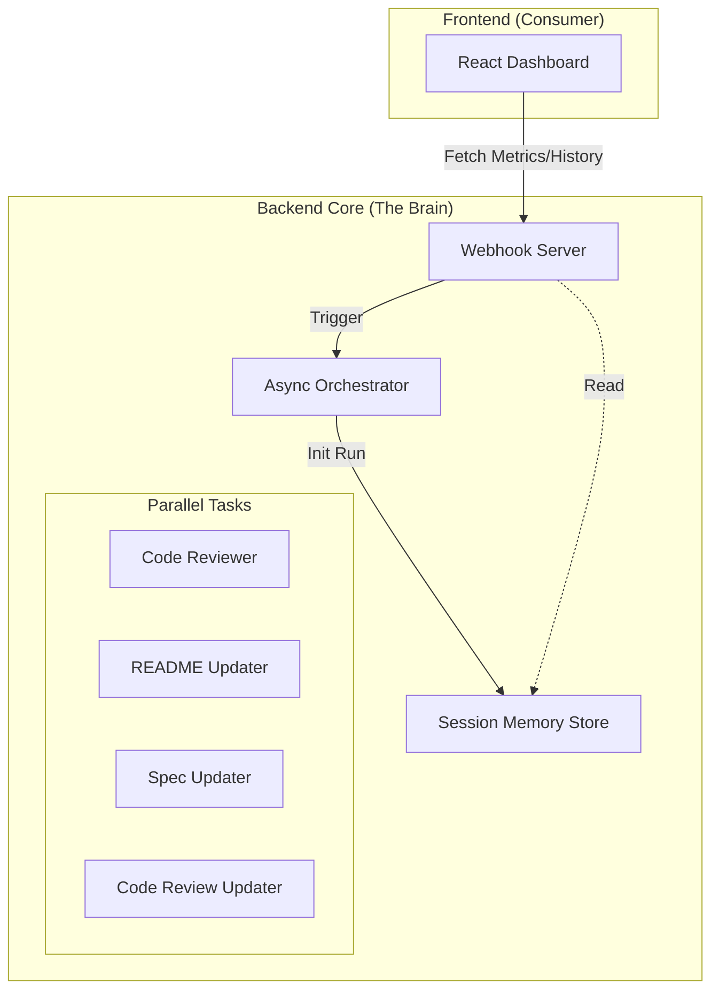

# 🤖 GitHub Automation Agent

An autonomous GitHub automation system that triggers on push events to perform intelligent code review, automatic README and code_review.md updates, and project progress documentation.

## 💡 Why This Agent?

- **Reduces repetitive code review work** — highlights risky changes and suggests fixes automatically
- **Keeps docs always fresh** — README, spec.md, and code_review.md stay in sync with actual code changes
- **Intelligent layer over GitHub** — uses advanced LLMs + async orchestration instead of rigid YAML workflows

## ✨ Features

### 1. 🔍 Automated Code Review
- **Intelligent Analysis**: Uses LLMs (GPT-4o / Claude 3.5 / Gemini Pro) to analyze code changes
- **Comprehensive Feedback**: Code quality, bugs, security, performance, best practices
- **Flexible Output**: Commit comments, PR comments, GitHub issues, and persistent code_review.md logging
- **Structured Reviews**: Strengths, issues, suggestions, security concerns
- **Session Memory**: Maintains historic context for continuous improvement

### 2. 📝 Automatic Documentation Updates
- **README Updater**: Context-aware, analyzes diffs to update docs
- **Spec Updater**: Dynamically appends development progress logs
- **Code Review Updater**: Appends review summaries to persistent logs

### 3. 📊 Real-Time Dashboard
- **Live Metrics**: Test coverage, LLM usage, token costs, efficiency scores
- **Visual Progress**: Task tracking, bug status, PR monitoring
- **Architecture Visualization**: Interactive Mermaid diagrams
- **System Logs**: Real-time log viewer with filtering
- **Security Status**: Bandit scan results and vulnerability tracking
- **Multi-Repository**: Switch between repositories with live updates

### 4. 📊 Project Progress & Metrics
- Visual progress tracking with real-time updates
- Test coverage and mutation testing integration using tools like mutmut
- LLM usage stats: token consumption, cost estimation, efficiency
- Security guardrails integrated with Bandit scans and CI/CD enforcement
- Multi-repository support with auto-detection of required files (README.md, spec.md)

### 5. 🛡️ Security Features
- HMAC-SHA256 verification of webhook signatures
- Minimal GitHub token scopes
- No secrets logged; credential storage limited to environment variables
- Automated security scans integrated in CI

### 6. 🗺️ Dynamic Architecture Diagram
- ARCHITECTURE.md includes a live Mermaid diagram reflecting system components and project progress
- Automatically updated via scripts/CI when system or specs change
- **Visualized in the Dashboard**

## 🚀 Quick Start

### Prerequisites
- Python 3.9+
- GitHub Personal Access Token (repo + issues + pull_requests scope)
- OpenAI, Anthropic, or Gemini API key

### Installation
```bash
git clone https://github.com/Amitro123/GithubAgent.git
cd GithubAgent
git checkout automation-agent-setup

python -m venv venv
# Linux/Mac
source venv/bin/activate
# Windows
venv\Scripts\activate

pip install -r requirements.txt
cp .env.example .env
```

Edit `.env` with your credentials.

### Run Locally

#### Option 1: FastAPI Server (Recommended - includes Dashboard API)
```bash
# Windows (PowerShell)
.venv\Scripts\python.exe run_api.py

# Linux/Mac
python run_api.py
```

#### Option 2: Flask Server (Legacy webhook-only)
```bash
# Windows (PowerShell)
$env:PYTHONPATH = "$PWD/src"
python -m automation_agent.main

# Linux/Mac
## 🧲 Agent Platform Integration (Optional)

Compatible with **Windsurf**, **AntiGravity**, **n8n**, or any agent orchestrator:

```
GitHub Push → Agent Platform Webhook → Orchestrator → GitHub API
```

**Example flow:**
1. Platform receives webhook → normalizes payload
2. Calls `code_reviewer.py` → posts review comment/issue
3. Calls `readme_updater.py` → creates documentation PR
4. Calls `spec_updater.py` → appends progress entry
5. Calls `code_review_updater.py` → appends review summary to logs
6. Platform handles retries, logging, notifications

## 📋 Workflow

1. **Developer pushes code** → webhook triggers
2. **Webhook verifies signature** → extracts diff/commit data
3. **Orchestrator runs 4 parallel tasks:**
   - Code review → comment/issue + persistent logs
   - README update → PR (if changes detected)
   - spec.md update → append entry
   - code_review.md update → append review summary with session memory
4. **Results posted** → repo stays documented automatically and progress tracked

## 🧪 Testing

### Health Check
```bash
curl http://localhost:8080/
```

### Test Full Flow
```bash
echo "# Test change" >> test.txt
git add test.txt
git commit -m "test: trigger automation"
git push
```

**Expected results:**
- ✅ Code review comment/issue
- ✅ README PR (if applicable)
- ✅ spec.md + code_review.md entries appended

### Test Status
**Current Pass Rate**: 100% (99/99 tests passing) as of 2025-11-30

- ✅ Unit Tests
- ✅ Integration Tests
- ✅ Edge Cases
- ✅ Load Tests

## 📦 Project Structure

```
automation_agent/
├── src/
│   └── automation_agent/
│       ├── webhook_server.py          # Flask webhook endpoint
│       ├── orchestrator.py            # Coordinates 4 parallel tasks
│       ├── session_memory.py          # Session Memory Store (NEW)
│       ├── code_reviewer.py           # LLM-powered code analysis
│       ├── code_review_updater.py     # Persistent review logging
│       ├── readme_updater.py          # Smart README updates
│       ├── spec_updater.py            # Progress documentation
│       ├── github_client.py           # GitHub API wrapper
│       ├── llm_client.py              # OpenAI/Anthropic/Gemini abstraction
│       └── main.py                    # Entry point
├── dashboard/                         # React + Vite dashboard (NEW)
│   ├── App.tsx                        # Main dashboard UI
│   ├── components/                    # UI components
│   ├── services/
│   │   └── apiService.ts              # Backend API client
│   └── DASHBOARD_SETUP.md             # Dashboard documentation
└── tests/                             # Pytest test suite
```

## 🗺️ Roadmap

- ✅ Multi-LLM support (Gemini, local models)
- 🔗 Multi-repo orchestration
- 🎛️ Per-branch policies (strict main, relaxed feature branches)
- 🔔 Integrations: Slack/Jira/n8n notifications
- 📊 Metrics dashboard for review quality and velocity

## 🔒 Security

- HMAC-SHA256 webhook signature verification
- Minimal GitHub token scopes
- No logging of secrets/diffs
- Environment-only credential storage
- Guardrails tests with Bandit integrated into CI (`.github/workflows/security.yml`)

## 📊 Dashboard

### Running the Dashboard

The project includes a real-time dashboard for monitoring automation metrics, test coverage, LLM usage, and system status.

**Start the dashboard:**
```bash
cd dashboard
npm install  # First time only
npm run dev
```

Dashboard runs on: **http://localhost:5173**

**Features:**
- 📊 Live test coverage and mutation scores
- 💰 LLM token usage and cost tracking
- 📋 Task progress and bug tracking
- 🔐 Security status from Bandit scans
- 📝 Real-time system logs
- 🗺️ Interactive architecture diagrams (Live from `ARCHITECTURE.md`)
- 📜 Session History & Run Logs

See [`dashboard/DASHBOARD_SETUP.md`](dashboard/DASHBOARD_SETUP.md) for detailed setup and API integration instructions.

## 🌐 Deployment

### Docker Deployment
```bash
docker build -t automation-agent .
docker run -p 8080:8080 --env-file .env automation-agent
```

### Docker Compose (Recommended)
```bash
docker-compose up -d
```

### CI/CD
Included GitHub Actions workflow (`.github/workflows/ci.yml`) runs tests on every push and builds Docker image on main branch pushes.

## Diagram

The project includes an ARCHITECTURE.md file with a live Mermaid diagram illustrating the system and project progress.

**Example Mermaid snippet:**



The diagram updates automatically as the project evolves.

## 📄 License
MIT